# 技能安装说明

仓库：https://github.com/Lawyeah-Tech/lawyeah

```bash
git clone --depth 1 https://github.com/Lawyeah-Tech/lawyeah.git
```

本仓库每个中文目录是一个整包。从 [`领域/`](../领域/) 或 [`合同/`](../合同/) 取出要用的那个文件夹，整包安装、整包卸载，不要拆成单个技能。

WorkBuddy 里我们叫「套件」，Codex 里叫「插件」。叫法不同，装的是同一件事。

先拿到包：克隆本仓库，或下载整个仓库后，只取出要用的那个中文目录。多数宿主接受把该目录打成 zip 再拖进对话框。

## WorkBuddy

### 安装

把包（文件夹或 zip）拖进 AI 对话框，输入：

```text
把这个技能套件整包安装到本机，不要拆成单个技能。
```

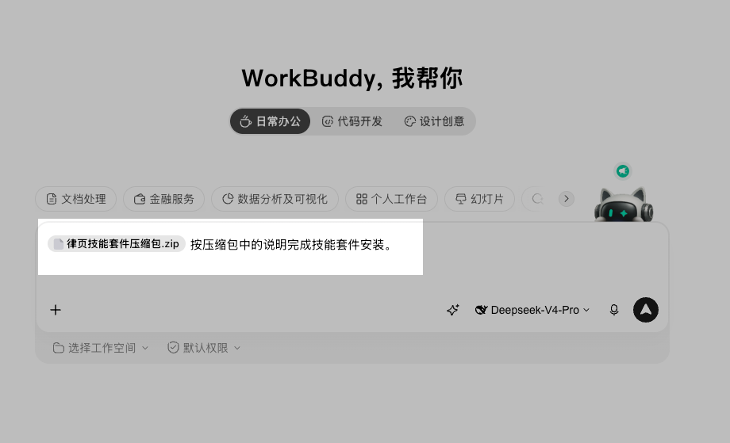

等它按包内说明装完。不同模型和本机环境步骤会有差别，装完会明确告诉你结果，类似：

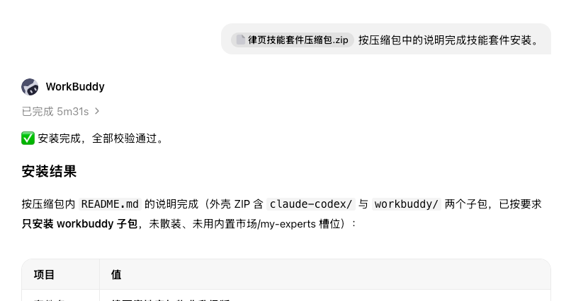

### 套件装到哪里

打开「专家·技能·连接器」里的「技能」。

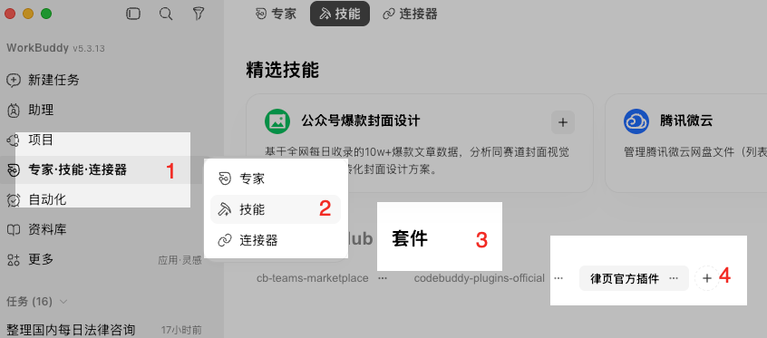

Agent 安装时通常会直接写成已安装，所以「律页官方插件」下面往往看不到刚装的套件。去技能界面右上角「我安装的」：

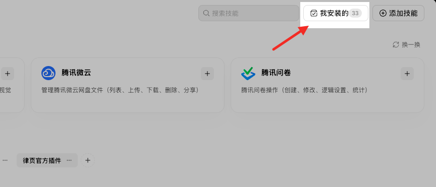

点开后是已装套件列表：

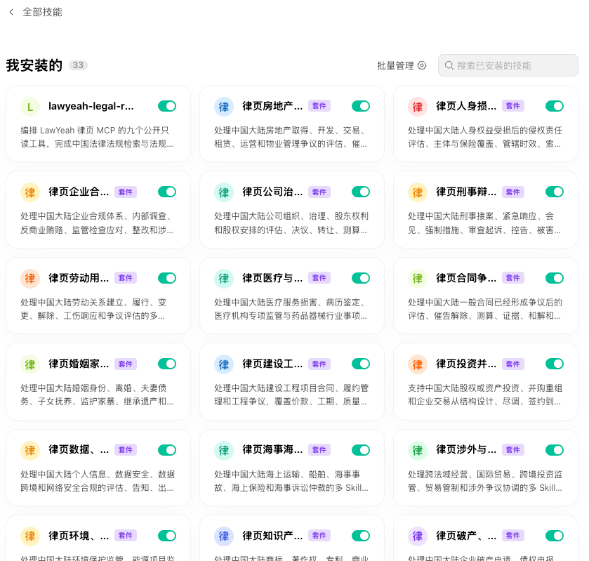

技能清单在套件里面。点开对应套件就能看到（下图是刑事套件示例，以你实际安装的为准）：

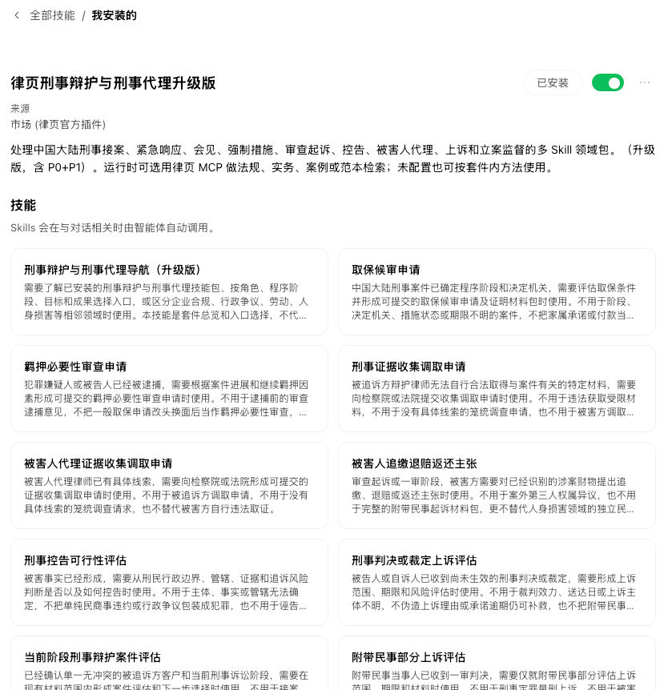

### 怎么用

在对话框输入 `/`，把目标技能召唤出来：

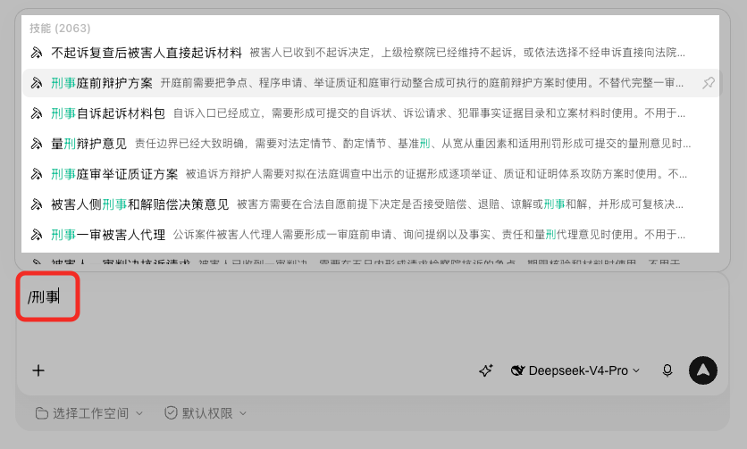

选中后回车，继续写你的指令或问题：

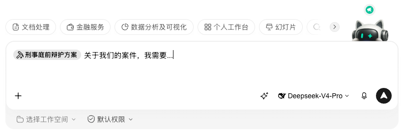

技能多的包，可以先开入口技能看边界，再进具体原子。

---

## Codex

### 安装

把包（文件夹或 zip）拖进 AI 对话框，输入：

```text
把这个技能插件整包安装到本机，不要拆成单个技能。
```

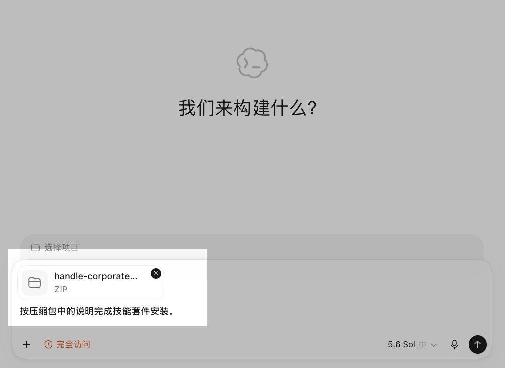

等它装完。不同环境和模型步骤会有差别，装完会明确告诉你结果，类似：

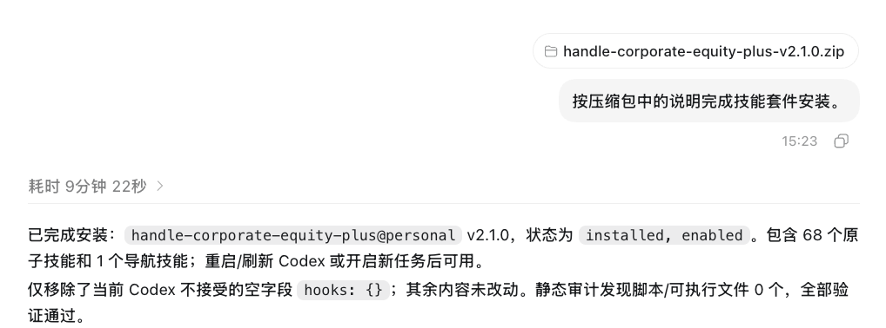

### 插件装到哪里

打开「插件」里的「个人」：

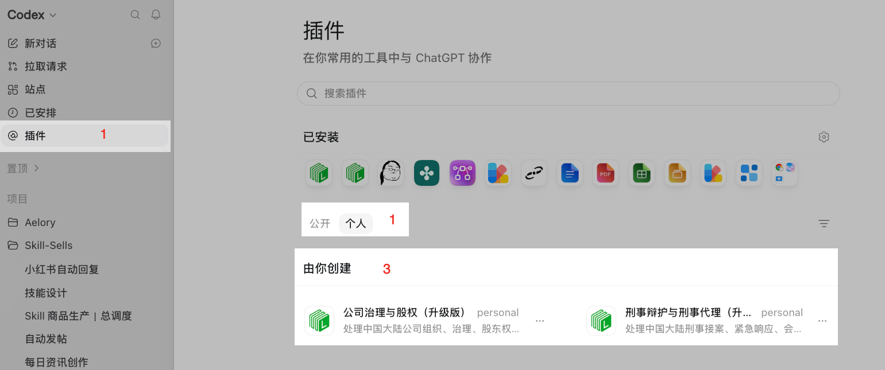

技能清单在插件里面。点开对应插件就能看到（下图是刑事套件示例，以你实际安装的为准）：

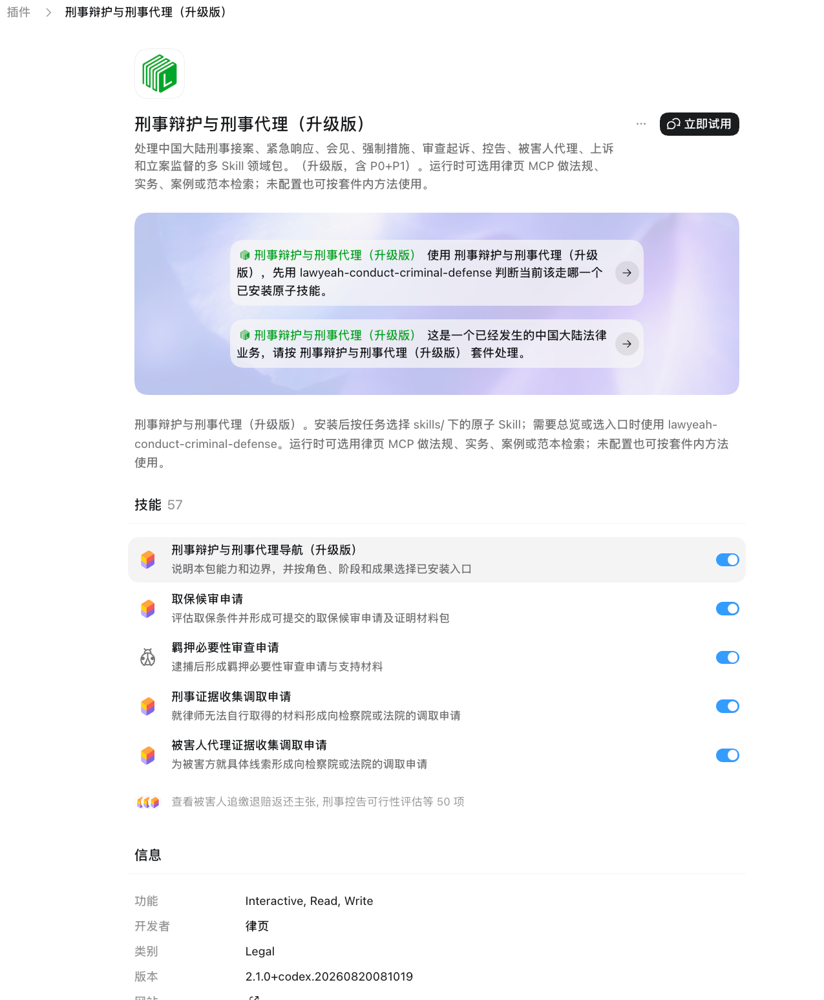

### 怎么用

在对话框输入 `/`，把目标技能召唤出来：

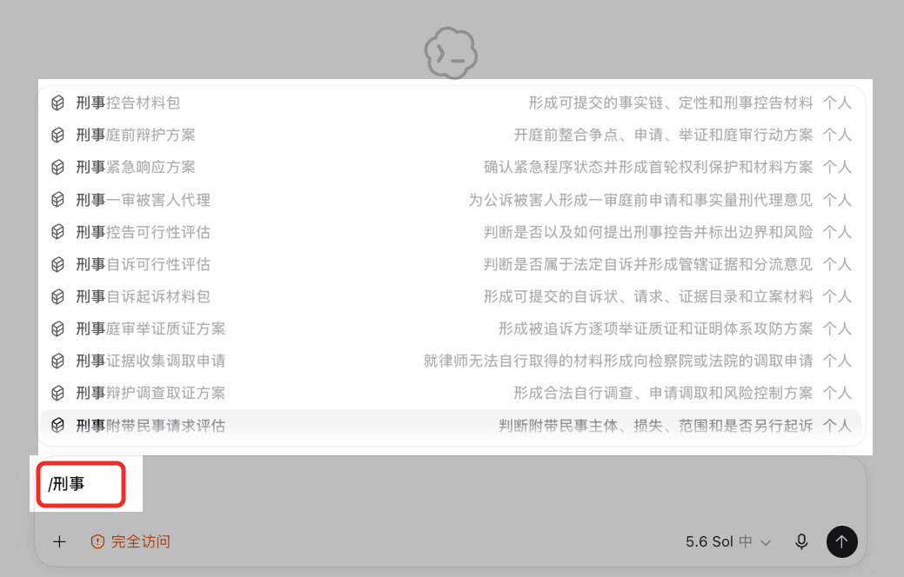

选中后回车，继续写你的指令或问题：

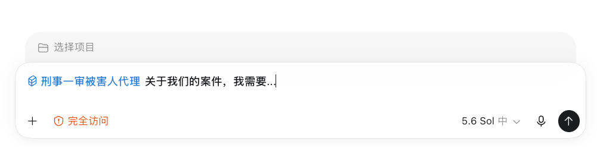

---

更新时用同名目录整体替换，不要逐文件合并。其他支持 Agent Skill 的电脑端环境，同样整包装入即可。
